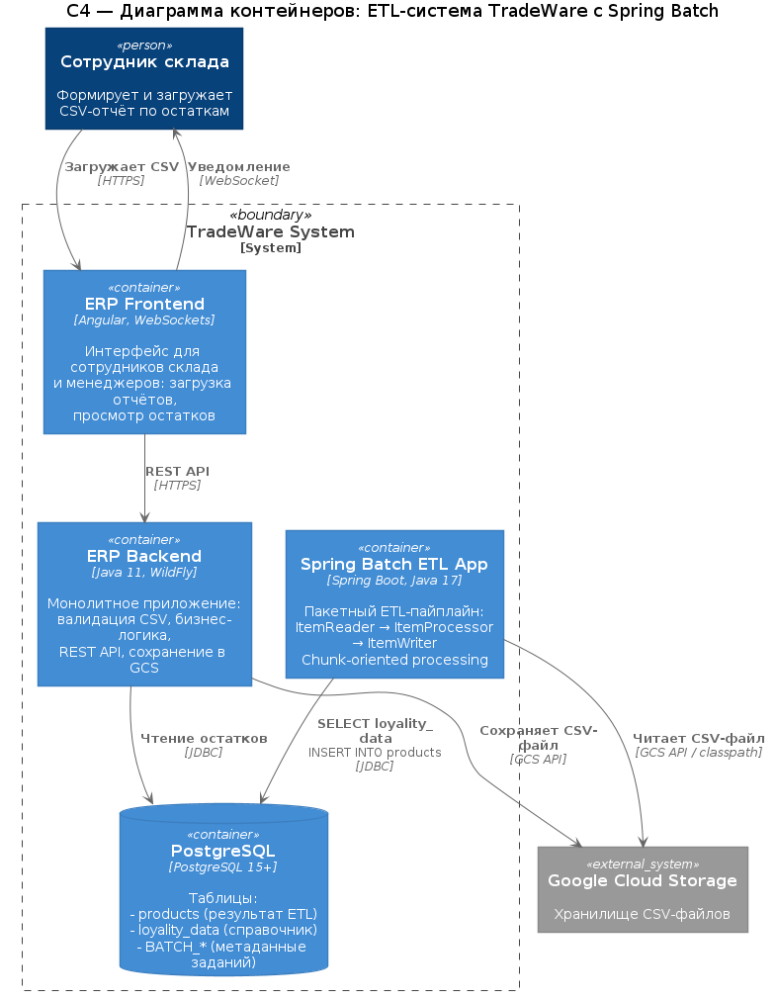

### **Название задачи:** Внедрение ETL-пайплайна на базе Spring Batch для пакетной обработки складских данных
### **Автор:** TradeWare Engineering Team
### **Дата:** 2026-04-08

---

### **Функциональные требования**

Верхнеуровневые Use Cases для ETL-пайплайна обработки складских данных.

| **№** | **Действующие лица или системы** | **Use Case** | **Описание** |
| :-: | :- | :- | :- |
| 1 | Сотрудник склада | Загрузка отчёта по остаткам | Сотрудник формирует CSV-файл из Excel-шаблона и загружает его через ERP-интерфейс. Файл проходит валидацию, сохраняется в GCS и передаётся на пакетную обработку. |
| 2 | Spring Batch Job | Извлечение данных (Extract) | Приложение считывает CSV-файл из хранилища (GCS / classpath) и десериализует строки в объекты `Product`. |
| 3 | Spring Batch Job | Обогащение данных (Transform) | Для каждого товара выполняется поиск в справочной таблице `loyality_data` по `productSku`. Если запись найдена, поле `productData` обновляется актуальным статусом программы лояльности. |
| 4 | Spring Batch Job | Загрузка в БД (Load) | Обработанные записи сохраняются в результирующую таблицу `products` в PostgreSQL с использованием batch-вставки. |
| 5 | Spring Batch Job | Уведомление о завершении | По завершении задания система логирует результат обработки: статус и содержимое обновлённых записей в таблице `products`. |
| 6 | Менеджер / аналитик | Просмотр актуальных остатков | После завершения ETL пользователь видит обновлённые данные по товарам, остаткам и статусу лояльности через ERP-интерфейс. |

### **Нефункциональные требования**

Архитектурно значимые требования к ETL-решению.

| **№** | **Требование** |
| :-: | :- |
| 1 | **Производительность:** среднее время обработки файла на 2 000 строк - до 30 секунд. |
| 2 | **Масштабируемость:** система должна выдерживать 100–150 параллельных загрузок в пиковые часы и обрабатывать до 400 000 строк в сутки с возможностью роста в 2–3 раза. |
| 3 | **Отказоустойчивость:** при сбое на этапе обработки Spring Batch обеспечивает возобновление задания с точки сбоя (restart/retry). Транзакционная обработка чанков гарантирует консистентность данных. |
| 4 | **Совместимость с Java-стеком:** решение должно интегрироваться с существующей Java-экосистемой компании (Java 11+, WildFly, PostgreSQL). |
| 5 | **Контейнеризация:** приложение должно запускаться в Docker-контейнерах и управляться через Docker Compose для последующего переноса в облачную инфраструктуру GCP. |
| 6 | **Наблюдаемость:** логирование ключевых этапов обработки (старт, трансформация, завершение) для интеграции с будущей системой мониторинга (ELK, Prometheus). |
| 7 | **Идемпотентность:** повторный запуск задания с тем же файлом не должен приводить к дублированию данных. |

### **Решение**

#### Обоснование выбора Spring Batch

Spring Batch выбран в качестве технологического решения для ETL-операций по следующим причинам:

1. **Зрелость и стабильность.** Spring Batch - промышленно проверенный фреймворк для пакетной обработки данных, развивающийся с 2007 года. Входит в экосистему Spring, что обеспечивает совместимость со стеком компании.

2. **Chunk-oriented processing.** Модель обработки данных чанками (read → process → write) позволяет эффективно управлять памятью при обработке больших файлов. Каждый чанк обрабатывается в рамках отдельной транзакции, что обеспечивает консистентность.

3. **Встроенные механизмы отказоустойчивости.** Spring Batch из коробки поддерживает:
   - **Retry** - автоматический повтор при transient-ошибках (сетевые таймауты, блокировки БД).
   - **Skip** - пропуск невалидных записей с продолжением обработки.
   - **Restart** - перезапуск задания с последнего успешного чанка.

4. **Метаданные заданий.** Spring Batch хранит историю выполнения в служебных таблицах (`BATCH_JOB_INSTANCE`, `BATCH_JOB_EXECUTION`, `BATCH_STEP_EXECUTION`), что обеспечивает аудит и возможность мониторинга.

5. **Масштабирование.** Поддержка параллельного выполнения шагов, партиционирования данных и remote chunking для горизонтального масштабирования.

6. **Интеграция с Java-экосистемой.** Естественная интеграция с Spring Boot, Spring Data, JPA, JDBC. Компания уже использует Java, что минимизирует порог входа для команды.

#### Архитектура решения

**C4 - диаграмма контейнеров (Container)**

Исходный файл диаграммы: [c4-container.puml](./diagrams/c4-container.puml)

**Логика ETL-пайплайна:**

1. **Extract (ItemReader):** `FlatFileItemReader` читает CSV-файл `product-data.csv` построчно, десериализуя каждую строку в объект `Product` (productId, productSku, productName, productAmount, productData).

2. **Transform (ItemProcessor):** `ProductItemProcessor` для каждого товара обращается к таблице `loyality_data` в PostgreSQL по ключу `productSku`. Если запись найдена, поле `productData` обновляется актуальным значением из программы лояльности.

3. **Load (ItemWriter):** `JdbcBatchItemWriter` выполняет batch-вставку обработанных записей в таблицу `products` в PostgreSQL.

Обработка идёт чанками (chunk size = 3), каждый чанк в отдельной транзакции. При завершении задания `JobCompletionNotificationListener` логирует все записи из таблицы `products` для верификации.

### **Альтернативы**

| **Решение** | **Описание** | **Плюсы** | **Минусы** |
| :- | :- | :- | :- |
| **Apache Airflow** | Оркестратор пайплайнов данных на Python. Позволяет описывать DAG (направленный ациклический граф) задач. | Гибкая оркестрация, богатый UI для мониторинга, поддержка расписаний, большое сообщество, интеграции с GCP. | Требует Python-компетенций (у команды стек на Java), отсутствует встроенная chunk-обработка, нужна отдельная инфраструктура (scheduler, worker, metadata DB). Оверхед для текущей задачи. |
| **Apache Spark** | Фреймворк для распределённой обработки данных. | Высокая производительность на больших объёмах, горизонтальное масштабирование, Java API (Spark SQL, Spark Batch). | Избыточная сложность для текущих объёмов (~400K строк/сутки). Требует кластера (Hadoop/YARN/K8s), значительные ресурсы, высокий порог входа. |
| **Apache NiFi** | Визуальный ETL-инструмент с drag-and-drop-интерфейсом. | Визуальное проектирование потоков, поддержка множества коннекторов, мониторинг из коробки. | Тяжеловесное решение, требует отдельного сервера, ограниченная интеграция с Java-кодом, сложнее кастомизировать бизнес-логику. |
| **Самописное решение (JDBC + Scheduler)** | Реализация ETL вручную на Java с использованием JDBC и Spring @Scheduled. | Полный контроль, минимальные зависимости, простота для простых сценариев. | Отсутствие встроенных механизмов retry/skip/restart, нет метаданных заданий, необходимо вручную реализовывать транзакционность чанков, мониторинг и аудит. Трудозатратно при масштабировании. |

**Обоснование выбора Spring Batch:**

Spring Batch - оптимальный выбор для TradeWare, так как он:
- Полностью совместим с существующим Java-стеком компании.
- Обеспечивает промышленную надёжность обработки без избыточной сложности.
- Не требует отдельной инфраструктуры (в отличие от Airflow, Spark, NiFi).
- Готов к масштабированию (partitioning, remote chunking) по мере роста.
- Имеет минимальный порог входа для Java-команды.

### **Недостатки, ограничения, риски**

| **Категория** | **Описание** | **Митигация** |
| :- | :- | :- |
| **Ограничение** | Spring Batch не является оркестратором - он выполняет отдельные задания, но не управляет зависимостями между пайплайнами. | Для оркестрации нескольких batch-заданий при необходимости использовать Spring Cloud Data Flow или Apache Airflow как оркестратор поверх Spring Batch. |
| **Ограничение** | Горизонтальное масштабирование (remote chunking, partitioning) требует дополнительной инфраструктуры (messaging, координация). | На начальном этапе достаточно вертикального масштабирования. Переход на remote chunking - при росте нагрузки свыше 1M строк/сутки. |
| **Риск** | Таблица `loyality_data` запрашивается для каждой строки (N+1 проблема). При большом объёме - деградация производительности. | Кэширование справочных данных в памяти перед обработкой чанка или использование `JdbcPagingItemReader` для предзагрузки. |
| **Риск** | При параллельных загрузках возможны конфликты блокировок в таблице `products`. | Использование upsert (INSERT ON CONFLICT) вместо INSERT, партиционирование по складам. |
| **Риск** | Spring Batch хранит метаданные в той же БД, что и бизнес-данные. При большом количестве запусков таблицы `BATCH_*` могут расти. | Периодическая очистка метаданных, выделение отдельной БД для метаданных при необходимости. |
| **Недостаток** | Отсутствует встроенный визуальный интерфейс для мониторинга (в отличие от Airflow). | Интеграция с Grafana/Prometheus для метрик, Spring Boot Actuator для health-check. |
