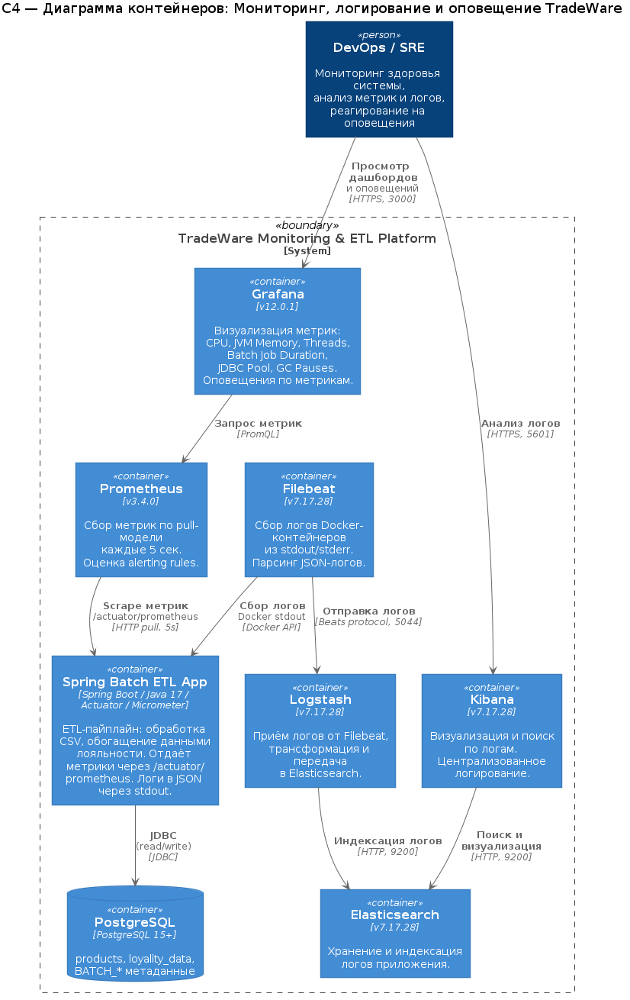

# Обоснование решений по мониторингу, логированию и оповещению

## 1. Архитектура решения

Решение строится на трёх столпах наблюдаемости (Observability):
- **Метрики** - Prometheus + Grafana
- **Логи** - Filebeat + Logstash + Elasticsearch + Kibana (ELK)

### C4-диаграмма архитектуры

Исходный файл: [c4-monitoring.puml](./diagrams/c4-monitoring.puml)

---

## 2. Обоснование выбора метрик

### Подход к выбору метрик

Для мониторинга Spring Batch ETL-приложения применяются методологии **USE** (Utilization, Saturation, Errors) и **RED** (Rate, Errors, Duration), адаптированные под пакетную обработку.

### Выбранные метрики

| **Метрика** | **Тип** | **PromQL** | **Обоснование** |
| :- | :-: | :- | :- |
| CPU Usage | Gauge | `process_cpu_usage * 100` | Утилизация CPU - ключевой индикатор нагрузки при пакетной обработке. Позволяет отслеживать перегрузку при обработке больших CSV-файлов. |
| JVM Heap Memory | Gauge | `jvm_memory_used_bytes{area="heap"}` | Объём потребляемой heap-памяти. При chunk-обработке больших файлов критично контролировать использование памяти для предотвращения OOM. |
| JVM Non-Heap Memory | Gauge | `jvm_memory_used_bytes{area="nonheap"}` | Metaspace и code cache. Рост может указывать на утечки метаданных или избыточную загрузку классов. |
| Live Threads | Gauge | `jvm_threads_live_threads` | Количество активных потоков. Индикатор параллелизма обработки и возможного thread exhaustion. |
| Application Uptime | Gauge | `process_uptime_seconds` | Время работы приложения. Позволяет выявить неожиданные перезапуски. |
| Spring Batch Job Duration | Timer | `spring_batch_job_seconds_sum` | Длительность выполнения batch-заданий. Ключевая метрика SLO - обработка 2000 строк за ≤30 секунд. |
| HTTP Request Rate | Counter | `rate(http_server_requests_seconds_count[1m])` | Частота запросов к actuator-эндпоинтам. Индикатор доступности метрик для Prometheus. |
| GC Pause Duration | Timer | `rate(jvm_gc_pause_seconds_sum[1m])` | Время пауз сборщика мусора. При длительных GC-паузах пакетная обработка замедляется. |
| HikariCP Connection Pool | Gauge | `hikaricp_connections_active` / `idle` / `total` | Состояние пула соединений БД. При пакетной обработке с частыми запросами к loyality_data - критично для выявления connection exhaustion. |

### Способ отправки метрик

**Выбран: Spring Boot Actuator + Micrometer + Prometheus Registry (pull-модель)**

Обоснование:
1. **Pull-модель Prometheus** - стандарт для мониторинга в контейнерной среде. Prometheus периодически (каждые 5 сек) запрашивает `/actuator/prometheus`.
2. **Micrometer** - встроен в Spring Boot, автоматически регистрирует JVM-метрики, HTTP-метрики и Spring Batch-метрики без написания дополнительного кода.
3. **Без JMX Exporter** - JMX Exporter требует sidecar-контейнера или java-agent, что усложняет деплой. Actuator проще и нативнее для Spring Boot.
4. **Приложение работает как web-сервер** - для корректного скрейпинга метрик приложение не завершается после batch-job, а остаётся запущенным (`spring-boot-starter-web`).

Альтернатива - **Prometheus Pushgateway** - подходит для короткоживущих batch-заданий, но требует дополнительной инфраструктуры и не рекомендуется Prometheus для постоянного мониторинга.

---

## 3. Обоснование выбора логирования

### Формат логов

**Выбран: JSON через `logstash-logback-encoder`**

Обоснование:
1. **Структурированные логи** - JSON-формат позволяет Filebeat и Logstash парсить логи без сложных grok-паттернов.
2. **Обогащение контекстом** - каждое лог-событие содержит: trace/span ID (для будущего трейсинга), имя приложения, timestamp (UTC), logger, level, thread, stack trace.
3. **Совместимость с ELK** - Elasticsearch нативно индексирует JSON-поля, что упрощает поиск и фильтрацию в Kibana.

### Пайплайн сбора логов

**Filebeat → Logstash → Elasticsearch → Kibana**

| **Компонент** | **Роль** | **Обоснование выбора** |
| :- | :- | :- |
| **Filebeat** | Лёгкий агент сбора логов | Минимальное потребление ресурсов (~10 MB RAM). Собирает логи Docker-контейнеров через Docker API, не требует модификации приложения. |
| **Logstash** | Трансформация и маршрутизация | Гибкие пайплайны обработки (фильтрация, парсинг, обогащение). Буферизация при пиковой нагрузке. |
| **Elasticsearch** | Хранение и индексация | Полнотекстовый поиск, агрегации, масштабируемость. Стандарт де-факто для хранения логов. |
| **Kibana** | Визуализация | Удобный UI для поиска, фильтрации и создания дашбордов по логам. |

Альтернативы:
- **Fluentd/Fluent Bit** - аналог Filebeat/Logstash. Fluent Bit легче, но экосистема ELK более зрелая и документированная.
- **Loki + Promtail** - легковесная альтернатива ELK от Grafana Labs. Не индексирует содержимое логов (только лейблы), что быстрее, но менее гибко для полнотекстового поиска.

---

## 4. Обоснование конфигурации оповещений

### Настроенные алерты

| **Алерт** | **Условие** | **Severity** | **Обоснование** |
| :- | :- | :-: | :- |
| `HighCpuUsage` | `process_cpu_usage > 80%` более 1 мин | Warning | При пакетной обработке CPU-всплески нормальны, но длительная нагрузка >80% указывает на проблему (неоптимальный запрос, бесконечный цикл). Порог 1 мин отсекает краткосрочные пики. |
| `HighMemoryUsage` | Heap usage > 85% более 2 мин | Critical | Приближение к OOM. 2-минутное окно исключает временные аллокации при обработке больших чанков. При срабатывании - немедленное реагирование. |

### Место конфигурации алертов

**Выбран: Prometheus Alerting Rules**

Обоснование:
1. **Prometheus** - оценивает правила каждые 5 секунд, что обеспечивает быструю реакцию.
2. **Декларативная конфигурация** - правила описаны в `alert-rules.yml`, хранятся в Git, легко ревьюятся.
3. **Интеграция с Grafana** - Grafana отображает активные алерты из Prometheus, дополняя визуализацию.

Для продакшена рекомендуется добавить **Alertmanager** для маршрутизации оповещений (email, Slack, PagerDuty) и группировки/дедупликации алертов.
